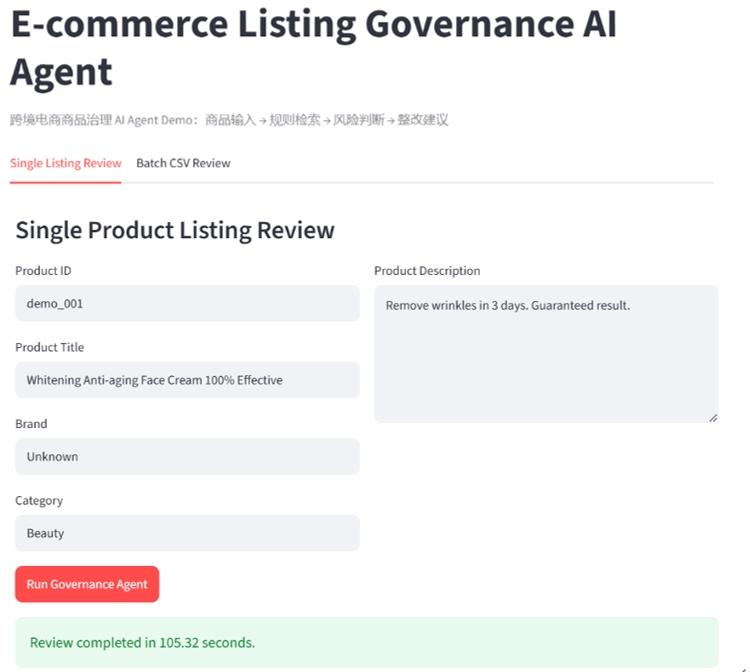
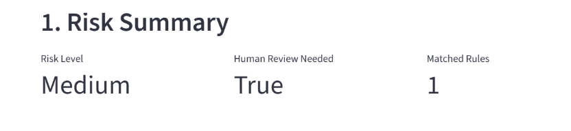
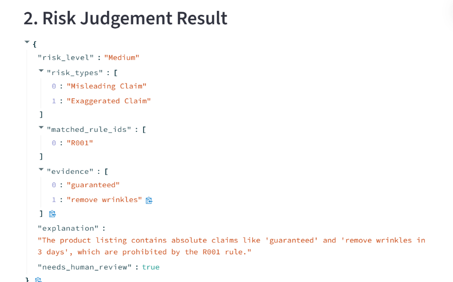
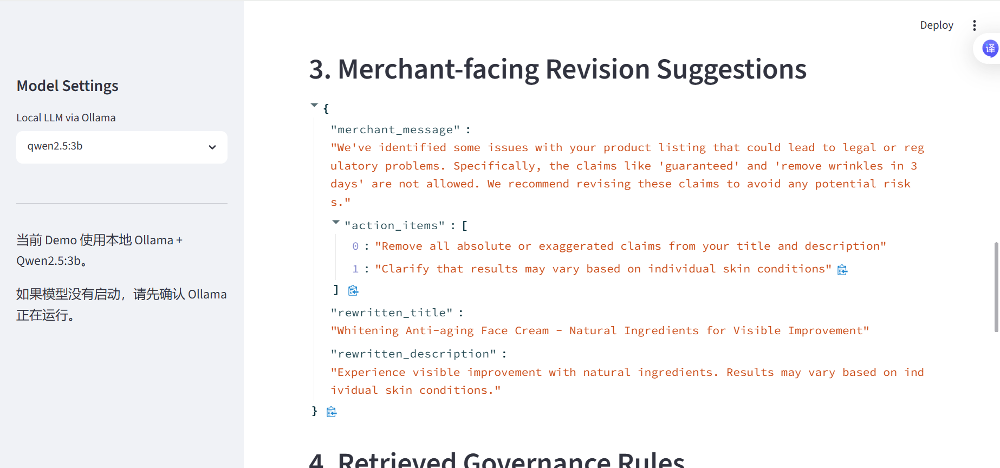
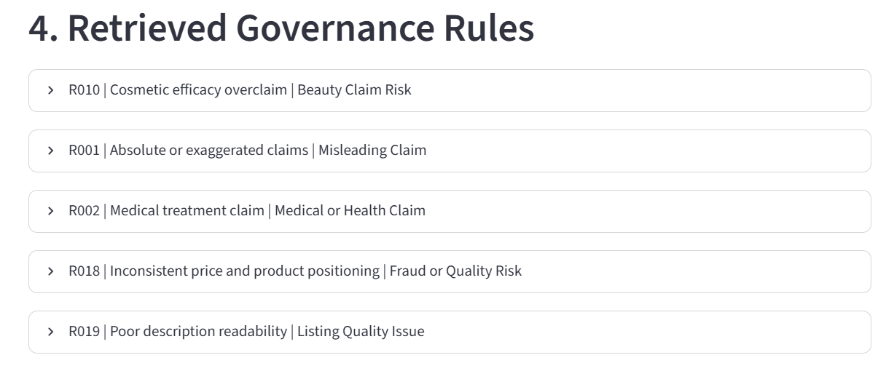
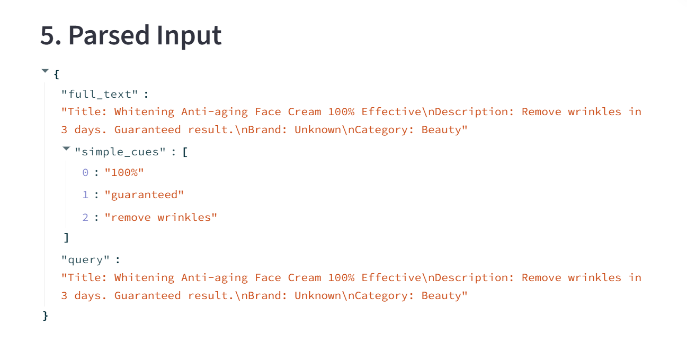
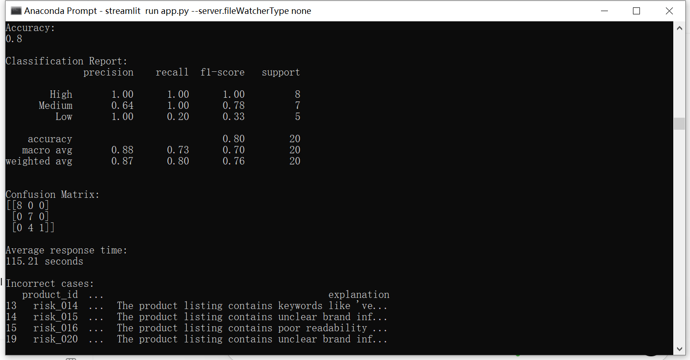

# 跨境电商商品治理 AI Agent

## 1. 项目背景

本项目是一个面向跨境电商场景的商品治理 AI Agent 原型，模拟国际电商平台在商品上架、商品信息审核、商家服务和风险治理中的 AI 辅助能力。

在跨境电商平台中，商家每天会上传大量商品信息，其中可能存在标题堆词、夸大宣传、禁限售商品、假货风险、医疗功效声明、隐私安全风险、认证信息不实、商品描述缺失等问题。传统人工审核方式成本高、效率低，且难以快速覆盖大规模商品信息。

本项目尝试通过 AI Agent 工作流，将商品信息解析、规则检索、风险判断和整改建议生成串联起来，辅助平台提升商品治理效率和商家服务体验。

---

## 2. 项目目标

本项目主要实现以下功能：

* 支持输入商品标题、描述、品牌、类目等信息；
* 基于自建商品治理规则库检索相关规则；
* 判断商品 listing 的风险等级、风险类型和命中规则；
* 输出结构化风险判断结果；
* 生成面向商家的整改建议；
* 支持单条商品检测和批量 CSV 商品检测；
* 构建人工标注测试样本，对 Agent 风险识别效果进行评估。

---

## 3. 数据来源说明

本项目使用两类数据：

### 3.1 公开商品数据

`data/products_sample.csv` 来自公开电商商品数据集，用于模拟平台商品 listing 输入。该数据主要包含商品标题、描述、品牌、类目等字段。

### 3.2 人工构造风险测试样本

`data/risky_test_cases.csv` 为人工构造并标注的风险测试样本，用于测试 Agent 对不同商品治理场景的识别能力。

测试样本覆盖以下场景：

* 禁限售商品；
* 误导性声明；
* 医疗功效声明；
* 假货与知识产权风险；
* 隐私安全风险；
* 危险品风险；
* 商品质量问题；
* 认证声明风险；
* 物流服务承诺风险；
* 正常低风险商品。

本项目不使用任何平台内部数据或非公开规则，仅用于学习、展示和原型验证。

---

## 4. 商品治理规则库

商品治理规则存储在：

```text
data/rules.json
```

规则库基于公开电商平台商品治理场景进行人工归纳，覆盖以下风险类型：

* **Misleading Claim**：误导性或夸大宣传；
* **Medical or Health Claim**：医疗或健康功效声明；
* **Restricted Product**：禁限售或受限商品；
* **Prohibited Product**：禁止销售商品；
* **IP or Counterfeit Risk**：知识产权或假货风险；
* **Listing Quality Issue**：商品信息质量问题；
* **Misleading Promotion**：误导性促销；
* **Unverified Certification**：未经验证的认证声明；
* **Privacy and Safety Risk**：隐私与安全风险；
* **Hazardous Product**：危险品风险；
* **Financial Claim Risk**：金融收益承诺风险；
* **Service Claim Risk**：物流或服务承诺风险。

每条规则包含：

```text
rule_id
rule_name
risk_type
risk_level
rule_basis
source_name
source_type
description
evidence_keywords
merchant_suggestion
```

规则库会被转化为向量，并存储在本地 Chroma 数据库中，用于 Agent 检索。

---

## 5. Agent 工作流设计

本项目使用 LangGraph 搭建 Agent 工作流。整体流程如下：

```text
商品信息输入
      ↓
输入解析
      ↓
规则检索
      ↓
风险判断
      ↓
整改建议生成
      ↓
结构化输出
```

### 5.1 输入解析节点

解析商品的标题、描述、品牌、类目等字段，并识别简单风险线索，例如：

```text
guaranteed
100% effective
replica
fake
cure
hidden camera
FDA approved
limited stock
```

### 5.2 规则检索节点

使用 Chroma 和 Sentence Transformers 对商品信息进行语义检索，从 `rules.json` 构建的规则知识库中召回最相关的治理规则。

### 5.3 风险判断节点

调用本地 Ollama + Qwen2.5 模型，基于商品信息和检索到的治理规则，输出结构化 JSON 风险判断结果，包括：

```text
risk_level
risk_types
matched_rule_ids
evidence
explanation
needs_human_review
```

### 5.4 整改建议节点

根据风险判断结果生成面向商家的整改建议，包括：

```text
merchant_message
action_items
rewritten_title
rewritten_description
```

---

## 6. 技术栈

本项目使用的主要技术包括：

```text
Python
LangGraph
Chroma
RAG
Sentence Transformers
Ollama
Qwen2.5
Streamlit
Pandas
Scikit-learn
```

其中：

* **LangGraph** 用于搭建 Agent 工作流；
* **Chroma** 用于构建本地向量知识库；
* **Sentence Transformers** 用于生成文本向量；
* **Ollama** 用于本地运行开源大模型；
* **Qwen2.5** 用于风险判断和整改建议生成；
* **Streamlit** 用于构建可交互 Demo 页面；
* **Scikit-learn** 用于评估准确率、分类报告和混淆矩阵。

---

## 7. Demo 页面功能

项目提供 Streamlit 可视化界面，包含两个主要功能模块。

### 7.1 Demo 页面展示













### 7.2 单条商品检测

用户可以输入：

```text
Product ID
Product Title
Brand
Category
Product Description
```

点击运行后，系统会输出：

* 风险等级；
* 是否需要人工复核；
* 命中的规则数量；
* 风险判断结果；
* 商家整改建议；
* 检索到的商品治理规则；
* 输入解析结果。

### 7.3 批量 CSV 检测

用户可以上传 CSV 文件，系统会批量分析商品风险，并输出：

* 商品 ID；
* 商品标题；
* 风险等级；
* 风险类型；
* 命中规则；
* 是否需要人工复核；
* 风险解释；
* 整改建议；
* 批量结果下载文件；
* 风险等级分布图。

---

## 8. 项目评估



本项目构建了 20 条人工构造并标注的风险测试样本，对 Agent 风险识别效果进行小规模评估。

评估文件：

```text
data/risky_test_cases.csv
```

评估结果输出文件：

```text
data/eval_risky_results.csv
```

初始评估结果如下：

```text
Accuracy: 0.80
```

分类表现：

```text
High-risk recall: 100%
Medium-risk recall: 100%
Low-risk recall: 20%
```

主要结论：

* Agent 对高风险和中风险商品识别效果较好；
* High-risk 和 Medium-risk 样本召回率均达到 100%；
* 主要问题是 Low-risk 商品存在误报，部分正常商品被判断为 Medium-risk；
* 后续可以通过优化风险等级 Prompt、补充正常样本、细化 Low-risk 判断规则来降低误报率。

该结果说明 Agent 已具备基本的商品治理风险识别能力，同时也暴露出治理类 AI 产品中常见的误报问题，即 over-flagging。

---

## 9. 如何运行项目

### 9.1 进入项目目录

```bash
cd /d D:\AI_Projects\ecom_governance_agent
```

### 9.2 激活虚拟环境

```bash
.venv\Scripts\activate
```

### 9.3 安装依赖

```bash
python -m pip install -r requirements.txt
```

### 9.4 下载商品数据

```bash
python download_data.py
```

### 9.5 更新治理规则

```bash
python update_rules.py
```

### 9.6 构建 Chroma 规则知识库

```bash
python build_kb.py
```

### 9.7 测试 Agent 工作流

```bash
python agent_graph.py
```

### 9.8 生成风险测试样本

```bash
python make_risky_test_cases.py
```

### 9.9 运行评估

```bash
python evaluate_risky_cases.py
```

### 9.10 启动 Streamlit Demo

```bash
python -m streamlit run app.py --server.fileWatcherType none
```

浏览器打开：

```text
http://localhost:8501
```

---

## 10. 项目文件结构

```text
ecom_governance_agent/
│
├─ app.py                         # Streamlit 可视化页面
├─ agent_graph.py                 # LangGraph Agent 主流程
├─ build_kb.py                    # 构建 Chroma 规则知识库
├─ download_data.py               # 下载公开商品数据
├─ update_rules.py                # 更新商品治理规则库
├─ make_risky_test_cases.py       # 生成合成风险测试样本
├─ evaluate_risky_cases.py        # 评估 Agent 风险识别效果
├─ requirements.txt               # 项目依赖
├─ README.md                      # 项目说明文档
├─ .gitignore                     # Git 忽略文件
│
├─ data/
│  ├─ products_sample.csv         # 公开商品样本数据
│  ├─ rules.json                  # 商品治理规则库
│  ├─ risky_test_cases.csv        # 人工构造风险测试集
│  ├─ eval_risky_results.csv      # 评估结果
│
├─ screenshots/
│  ├─ 01_streamlit_home.png
│  ├─ 02_1single_review_result.png
│  ├─ 02_2single_review_result.png
│  ├─ 02_3single_review_result.png
│  ├─ 03_retrieved_rules.png
│  ├─ 04_batch_review_result.png
│  ├─ 05_evaluation_metrics.png
```

---

## 11. 项目亮点

本项目的主要亮点包括：

1. 贴近真实跨境电商商品治理场景；
2. 使用公开商品数据和自建规则库，避免依赖内部权限；
3. 使用 LangGraph 搭建清晰的 Agent 工作流；
4. 使用 Chroma 构建 RAG 规则检索能力；
5. 使用本地 Ollama + Qwen2.5，便于复现和演示；
6. 使用 Streamlit 实现可交互 Demo；
7. 构建人工标注测试样本并进行效果评估；
8. 能够从评估结果中发现误报问题，并进行 Prompt 优化。

---

## 12. 项目局限与后续优化方向

本项目仍是一个原型系统，存在以下局限：

* 规则库规模较小，仅覆盖常见治理场景；
* 测试样本数量较少，评估结果仅代表小规模验证；
* 当前主要处理文本信息，尚未接入商品图片审核；
* 本地模型推理速度较慢；
* 对 Low-risk 商品存在一定误报；
* 暂未加入人工复核闭环和线上反馈机制。

后续可以从以下方向继续优化：

* 扩展规则库数量和覆盖范围；
* 增加更多真实公开商品样本和正常低风险样本；
* 优化风险等级 Prompt，降低误报率；
* 引入更快的本地模型或 API 模型；
* 增加多语言商品 listing 审核；
* 增加商品图片审核能力；
* 加入 human-in-the-loop 人工复核机制；
* 设计商家申诉与反馈闭环；
* 增加仪表盘展示不同风险类型的分布情况。
